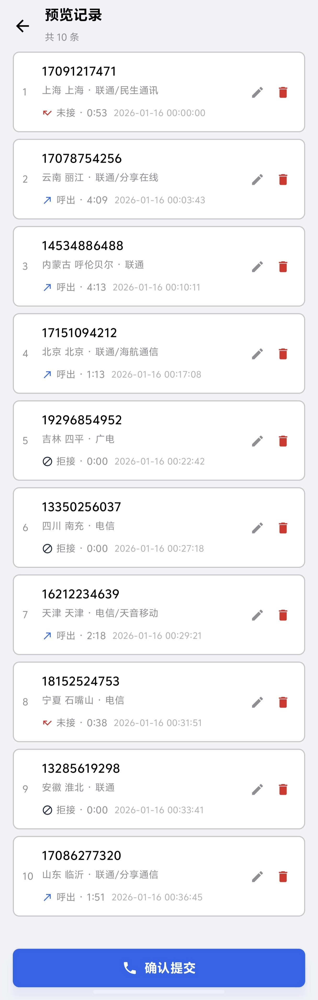

---

## 📖 目录

- [快速开始](#快速开始)
- [单条生成](#单条生成)
- [批量生成](#批量生成)
- [历史记录](#历史记录)
- [模板功能](#模板功能)
- [软件授权](#软件授权)
- [常见问题](#常见问题)
- [界面截图](./images/README.md)

---

## 快速开始

### 首次启动

1. 打开应用后，请先阅读并同意《用户协议》和《隐私政策》
2. 根据系统提示授予必要的权限（通话记录权限）
3. 现在您可以开始使用应用了！

### 界面布局

应用底部有三个主要标签页：

| 标签 | 功能 |
|------|------|
| **生成** | 创建新的通话记录 |
| **历史** | 查看已生成的记录 |
| **关于** | 帮助与设置 |

> 💡 **提示**: 您可以通过左右滑动在三个页面之间快速切换。

---

## 单条生成

单条生成允许您精确创建一条通话记录。

### 操作步骤

#### 第一步：输入电话号码


- 直接在输入框中输入电话号码
- 或点击右侧的 📇 图标从通讯录选择联系人

#### 第二步：选择通话类型

点击图标选择通话类型：

| 图标 | 类型 | 说明 |
|:----:|------|------|
| 📞➡️ | **呼出** | 表示您主动拨打的电话 |
| 📞⬅️ | **呼入** | 表示您接听的来电 |
| 📞❌ | **未接** | 表示未接听的来电 |
| 📞🚫 | **拒接** | 表示您拒绝接听的来电 |

#### 第三步：设置日期和时间

1. 点击 **日期** 栏，在弹出的日期选择器中选择通话日期
2. 点击 **时间** 栏，在弹出的时间选择器中选择通话时间

> ⚠️ **注意**: 通话时间应设置为过去的时间，未来时间可能无法正常显示。

#### 第四步：设置通话时长

滑动或点击选择通话时长：
- **时**: 0-23 小时
- **分**: 0-59 分钟
- **秒**: 0-59 秒

> 💡 **提示**: 对于"未接"和"拒接"类型，时长表示响铃时间。

#### 第五步：选择 SIM 卡

如果您的手机支持双卡，可以选择：
- **卡1**: 使用卡槽1
- **卡2**: 使用卡槽2

> 单卡手机会自动选择，无需手动设置。

#### 第六步：生成记录

点击 **生成记录** 按钮，系统会将该记录写入手机的通话记录中。

---

## 批量生成

批量生成允许您一次创建多条通话记录，适合需要快速生成大量记录的场景。

### 进入批量生成

在"生成"页面，点击顶部的 **批量** 标签切换到批量生成模式。

### 选择生成方式

#### 方式一：归属地随机

系统根据您选择的地区随机生成电话号码。

**操作步骤**:

1. 点击 **省份** 选择器，勾选需要的省份（可多选）
2. 可选：点击 **城市** 进一步选择具体城市
3. 在 **生成数量** 中输入需要生成的条数

> 💡 **提示**: 归属地随机会生成真实格式的手机号码，并标注省市和运营商信息。

#### 方式二：指定号码

您直接输入需要使用的电话号码。

**操作步骤**:

1. 在号码输入框中输入电话号码
2. 每行输入一个号码
3. 系统会为每个号码生成一条记录

**输入示例**:
```
13812345678
13987654321
15012345678
```

### 配置时间

#### 模式一：范围内随机

在指定的时间范围内随机分配通话时间。

**配置项目**:
- **开始时间**: 设置时间范围的起点
- **结束时间**: 设置时间范围的终点

> 📝 **示例**: 设置 "2026年1月1日 09:00" 到 "2026年1月15日 18:00"，系统会在这个范围内随机分配各条记录的时间。

#### 模式二：开始间隔随机

从指定时间开始，按随机间隔依次生成。

**配置项目**:
- **开始时间**: 第一条记录的时间
- **最小间隔**: 相邻记录的最小时间间隔（秒）
- **最大间隔**: 相邻记录的最大时间间隔（秒）

> 📝 **示例**: 开始时间为 "09:00"，间隔设置为 60-300 秒，则第二条记录会在 09:01-09:05 之间生成。

### 配置通话时长

设置每条记录的通话时长范围：
- **最小时长**: 通话时长不会低于此值
- **最大时长**: 通话时长不会超过此值

> 系统会在此范围内随机生成每条记录的时长。

### 其他设置

| 设置项 | 选项 | 说明 |
|--------|------|------|
| 通话类型 | 呼出/呼入/未接/拒接/**随机** | 选择"随机"时系统自动随机分配 |
| SIM卡 | 卡1/卡2 | 所有记录使用相同的卡槽 |

### 预览和确认

1. 配置完成后，点击 **预览** 按钮
2. 在预览页面查看即将生成的所有记录
3. 如需修改：点击单条记录进行编辑
4. 确认无误后，点击 **确认生成** 按钮



---

## 历史记录

历史页面记录了您通过本应用生成的所有通话记录。

### 查看历史

点击底部的 **历史** 标签，即可看到完整的生成记录列表。

每条记录显示：
- 电话号码（及联系人名称，如有）
- 通话时间
- 通话时长
- 通话类型图标
- 归属地信息（如有）

### 搜索记录

1. 点击顶部的搜索图标 🔍
2. 输入电话号码或联系人名称
3. 列表会实时显示匹配结果

### 筛选记录

1. 点击筛选图标 ⚙️
2. 设置筛选条件：
   - **通话类型**: 只显示特定类型的记录
   - **时间范围**: 今天/最近7天/最近30天/自定义
   - **SIM卡**: 只显示特定卡槽的记录
3. 应用筛选条件

### 删除记录

#### 删除单条

向左滑动记录条目，出现删除按钮，点击即可删除。

#### 批量删除

1. **长按** 任意一条记录，进入多选模式
2. 点击需要删除的记录进行选择（或点击"全选"）
3. 点击垃圾桶图标 🗑️
4. 在确认对话框中点击 **确定**

> ⚠️ **注意**: 删除的是应用内的历史记录，系统通话记录需在系统设置中管理。

---

## 模板功能

模板功能可以保存常用的配置，下次使用时一键应用。

### 保存模板

#### 在单条生成中

1. 配置好各项参数后
2. 点击保存图标 🔖
3. 输入模板名称和备注（可选）
4. 点击 **保存**

#### 在批量生成中

1. 配置好所有参数后
2. 点击保存图标 🔖
3. 输入模板名称和备注（可选）
4. 点击 **保存**

> 💡 **提示**: 模板不会保存日期时间，应用时会自动使用当前时间。

### 使用模板

1. 点击模板列表图标（在生成页面的标题栏）
2. 查看已保存的模板列表
3. 点击要使用的模板
4. 系统会自动填充配置参数
5. 根据需要调整后生成记录

### 管理模板

在模板列表页面：

| 操作 | 方法 |
|------|------|
| 编辑模板 | 点击模板卡片上的编辑图标，修改名称或备注 |
| 删除模板 | 点击模板卡片上的删除图标，确认后删除 |
| 搜索模板 | 使用顶部搜索栏按名称搜索 |

---

## 软件授权

### 查看授权状态

1. 进入 **关于** 页面
2. 点击 **软件授权** 选项
3. 查看当前的授权状态

### 激活软件

#### 第一步：获取设备指纹

在授权页面，您会看到一串设备指纹代码。点击 **复制** 按钮将其复制到剪贴板。

#### 第二步：获取授权码

通过正规渠道获取与您设备指纹对应的授权码。

#### 第三步：输入授权码

1. 在授权码输入框中粘贴或输入授权码
2. 点击 **激活** 按钮
3. 等待验证完成

#### 激活成功

激活成功后，页面会显示：
- ✅ 已激活状态
- 授权到期时间

### 授权说明

| 状态 | 说明 |
|------|------|
| 未激活 | 软件尚未激活，部分功能可能受限 |
| 已激活 | 软件已激活，可正常使用 |
| 已过期 | 授权已过期，请续期或重新激活 |

---

## 常见问题

### Q1: 生成的记录在哪里查看？

**A**: 生成的记录会写入系统的通话记录中，您可以在手机的"电话"应用中查看。同时，您也可以在本应用的"历史"页面查看所有通过本应用生成的记录。

---

### Q2: 可以生成未来时间的通话记录吗？

**A**: 技术上可以设置未来时间，但不建议这样做。系统通话记录通常按时间排序，未来时间的记录可能会显示在最顶部，看起来不自然。

---

### Q3: 生成的通话记录会被检测出来吗？

**A**: 本应用生成的通话记录与正常通话产生的记录在技术上没有区别，都是写入系统的标准通话记录数据库。

---

### Q4: 如何删除已生成的系统通话记录？

**A**: 本应用的"历史"页面删除的是应用内的记录。如需删除系统中的通话记录，请前往手机的"电话"应用或系统设置中进行操作。

---

### Q5: 批量生成时出现"时间冲突"提示怎么办？

**A**: 当设置的时间范围内无法容纳所有通话记录时，系统会提示时间冲突。您可以：
- 扩大时间范围
- 减少生成数量
- 缩短通话时长范围
- 选择"强制生成"（记录时间可能会重叠）

---

### Q6: 模板可以保存多少个？

**A**: 理论上没有数量限制，您可以根据需要保存多个模板。建议使用有意义的名称，便于后续查找。

---

### Q7: 双卡手机怎么选择 SIM 卡？

**A**: 在生成页面中，如果您的手机支持双卡，会显示"卡1"和"卡2"选项。选择哪张卡，生成的通话记录就会标记为该卡的通话。*不同厂商的手机，双卡显示可能略有不同，不一定完全支持*

---

### Q8: 应用需要网络吗？

**A**: 核心的通话记录生成功能不需要网络。以下功能需要网络：
- 检查应用更新
- 提交意见反馈
- 激活软件授权

---

### Q9: 如何更新应用？

**A**: 
1. 进入 **关于** 页面
2. 点击 **检查更新**
3. 如有新版本，按提示下载安装

---

### Q10: 如何反馈问题或建议？

**A**: 
1. 进入 **关于** 页面
2. 点击 **意见反馈**
3. 填写反馈内容
4. 可选：留下联系方式
5. 点击 **提交**

我们会认真阅读每一条反馈！

---

### Q11: 如何卸载应用？

**A**: 
1. 进入 **设置** -> **应用管理**
2. 找到本应用，点击 **卸载**
3. 按提示完成卸载

---

## 联系我们

如有任何问题，欢迎通过应用内的"意见反馈"功能联系我们。

---


