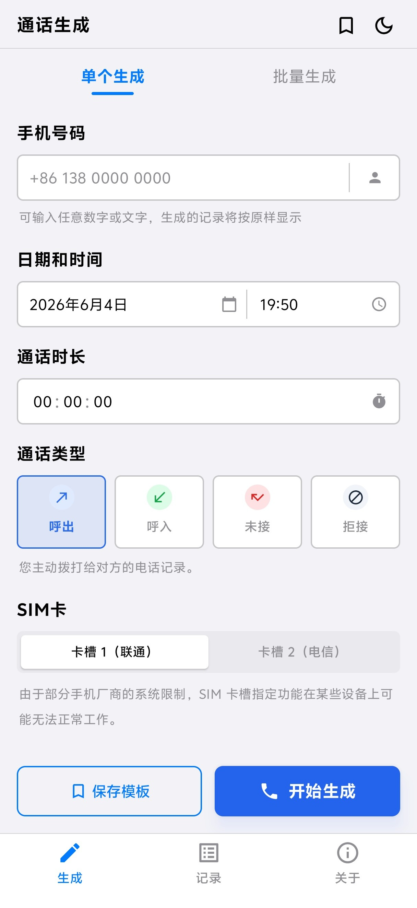
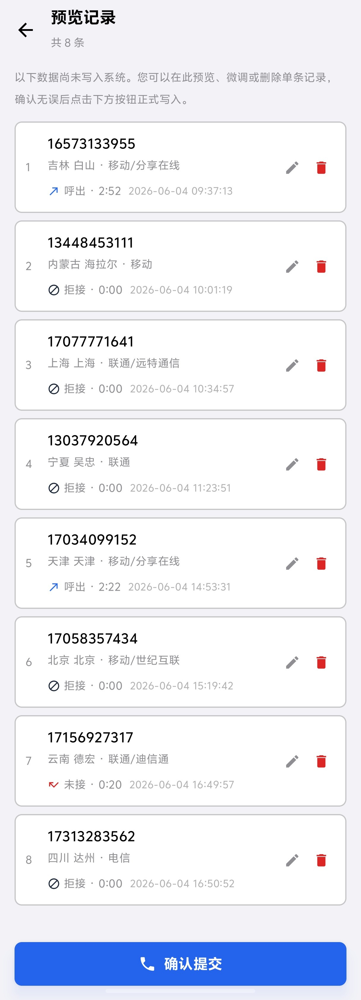

# CallLogTester 使用手册

## 📱 软件简介

**CallLogTester** 是一款专业的通话记录生成工具，帮助用户快速创建和管理通话记录。

- 🌐 **官方网站**: [https://calllogtester.1688122.xyz](https://calllogtester.1688122.xyz)

### 核心功能

| 功能 | 说明 |
|------|------|
| **单条生成** | 精确创建一条通话记录，支持自定义号码、类型、时间、时长和 SIM 卡 |
| **批量生成** | 一次生成多条记录，支持归属地随机、指定号码、生成时间规则与预览确认 |
| **拨号行为协同** | 支持真实电信信令与纯虚拟无信令双仿真模式，支持设为默认电话接管外呼信令，提供零资费自动化仿真拨打与闭环测试 |
| **历史管理** | 查看、搜索、筛选和删除已生成的通话记录 |
| **模板系统** | 保存常用配置为模板，一键快速应用 |

### 适用场景

- 测试手机通话记录功能
- 展示或演示用途
- 自动化测试与系统拨号行为协同联调
- 开发调试需要

> **注意**: 由于不同手机厂商和系统版本的差异，SIM 卡槽的模拟功能在部分设备上可能无法正常工作。如遇此情况属于设备兼容性限制，并非软件问题。

> **提示**: 请合法合规使用本软件，仅用于个人测试或演示目的。

---

## 目录

- [软件简介](#-软件简介)
- [软件下载](#-软件下载)
- [快速开始](#快速开始)
- [单条生成](#单条生成)
- [批量生成](#批量生成)
- [拨号行为协同测试](#拨号行为协同测试)
- [历史记录](#历史记录)
- [模板功能](#模板功能)
- [软件授权](#软件授权)
- [常见问题](#常见问题)
- [联系我们](#联系我们)
- [界面截图](./images/README.md)

---

## 📥 软件下载

**CallLogTester** 官方正版安装包统一通过官方网站分发。

### 官方下载地址

- 🌐 **CallLogTester 官方网站**: [https://calllogtester.1688122.xyz/](https://calllogtester.1688122.xyz/)

### 下载与安装步骤

1. **访问官网**：使用手机或电脑浏览器打开 [CallLogTester 官方网站 (https://calllogtester.1688122.xyz/)](https://calllogtester.1688122.xyz/)。
2. **下载安装包**：在官网页面点击「下载」或「Android APK 下载」按钮，获取最新版 Android 安装包（`.apk` 格式）。
3. **允许安装未知来源**：在 Android 手机上打开下载完成的 APK 文件，如果系统弹出未知应用来源安装安全提示，请根据手机系统指引点击“允许本次安装”或在“设置 - 应用管理”中开启安装权限。
4. **完成安装**：等待系统安装完成后，在桌面点击应用图标启动。

> ⚠️ **安全提醒**: 
> 为保障您的设备安全与正常授权服务，请务必认准官方唯一网站 [https://calllogtester.1688122.xyz/](https://calllogtester.1688122.xyz/) 下载正版软件，切勿从第三方未知网盘、论坛或破解分享渠道下载，以防被植入恶意程序或因客户端验签失败触发安全熔断。

---

## 快速开始

### 首次启动

1. 打开应用后，请先阅读并同意《用户协议》和《隐私政策》
2. 根据系统提示授予必要的权限（通话记录权限）
3. 现在您可以开始使用应用了！

### 界面布局

应用底部有三个主要标签页：

| 标签 | 功能 |
|------|------|
| **生成** | 创建新的通话记录 |
| **历史** | 查看已生成的记录 |
| **关于** | 帮助与设置 |

> 💡 **提示**: 您可以通过左右滑动在三个页面之间快速切换。

---

## 单条生成

单条生成允许您精确创建一条通话记录。

### 操作步骤

#### 第一步：输入电话号码



- 直接在输入框中输入电话号码
- 或点击右侧的 📇 图标从通讯录选择联系人

#### 第二步：选择通话类型

点击图标选择通话类型：

| 图标 | 类型 | 说明 |
|:----:|------|------|
| 📞➡️ | **呼出** | 表示您主动拨打的电话 |
| 📞⬅️ | **呼入** | 表示您接听的来电 |
| 📞❌ | **未接** | 表示未接听的来电 |
| 📞🚫 | **拒接** | 表示您拒绝接听的来电 |

#### 第三步：设置日期和时间

1. 点击 **日期** 栏，在弹出的日期选择器中选择通话日期
2. 点击 **时间** 栏，在弹出的时间选择器中选择通话时间

> ⚠️ **注意**: 通话时间应设置为过去的时间，未来时间可能无法正常显示。

#### 第四步：设置通话时长

滑动或点击选择通话时长：
- **时**: 0-23 小时
- **分**: 0-59 分钟
- **秒**: 0-59 秒

> 💡 **提示**: 对于"未接"和"拒接"类型，时长表示响铃时间。

#### 第五步：选择 SIM 卡

如果您的手机支持双卡，可以选择：
- **卡1**: 使用卡槽1
- **卡2**: 使用卡槽2

> 单卡手机会自动选择，无需手动设置。

#### 第六步：生成记录

点击 **生成记录** 按钮，系统会将该记录写入手机的通话记录中。

---

## 批量生成

批量生成允许您一次创建多条通话记录，适合需要快速生成大量记录的场景。

### 进入批量生成

在"生成"页面，点击顶部的 **批量** 标签切换到批量生成模式。

### 选择生成方式

#### 方式一：归属地随机

系统根据您选择的地区随机生成电话号码。

**操作步骤**:

1. 点击 **省份** 选择器，勾选需要的省份（可多选）
2. 可选：点击 **城市** 进一步选择具体城市
3. 在 **生成数量** 中输入需要生成的条数（范围 1~300）

> 💡 **提示**: 归属地随机会生成真实格式的手机号码，并标注省市和运营商信息。

#### 方式二：指定号码

您直接输入需要使用的电话号码。

**操作步骤**:

1. 在号码输入框中输入电话号码
2. 每行输入一个号码
3. 系统会自动统计号码数量，并按当前时间规则决定是否重复生成

**输入示例**:
```
13812345678
13987654321
15012345678
```

### 配置时间

#### 模式一：范围内随机

先选择日期范围，再通过生成时间规则决定哪些日期与时段可参与生成。

**配置项目**:
- **开始日期**: 设置日期范围的起点
- **结束日期**: 设置日期范围的终点

> 💡 **提示**: 日期范围按整天计算，具体生成时刻由下方的生成时段控制。

##### 生成时间规则（仅范围内随机）

**1. 日期规则**

- **每天**: 范围内的每一天都可参与生成
- **法定工作日**: 仅在所选范围内属于法定工作日的日期生成，非工作日会自动跳过

> ⚠️ **注意**: 法定工作日仅支持 **当前年份内且不跨年** 的日期范围。如果当年节假日数据暂不可用，该选项不会显示。

**2. 时间段应用方式**

- **按天重复**: 每个符合条件的日期都会按同一组生成时段重新生成一轮
- **范围内不重复**: 把所有符合条件日期中的有效时段合并后，在整个范围内统一分配

**3. 生成时段**

- 最多支持设置 **5 个时段**
- 默认提供两个时段：`09:00-12:00`、`13:30-18:00`
- 只有落在这些时段内的时间才会被用于生成记录

##### 数量与号码规则（仅范围内随机）

- **归属地随机**
  - 选择 **按天重复** 时，生成数量表示 **每天生成多少条**
  - 选择 **范围内不重复** 时，生成数量表示 **整个范围内的总条数**

- **指定号码**
  - 选择 **按天重复** 时，每个符合条件的日期都会重复这批号码
  - 选择 **范围内不重复** 时，每个号码在整个范围内只会生成一次

> 💡 **提示**: 页面会自动生成 **规则摘要**，帮助您确认当前的日期规则、时段和数量解释。

> 📝 **示例**: 设置 "2026年1月1日" 到 "2026年1月15日"，生成时段为 `09:00-12:00`、`13:30-18:00`，则记录只会落在这些有效日期与时段内。

#### 模式二：开始间隔随机

从指定时间开始，按随机间隔依次生成。

**配置项目**:
- **开始时间**: 第一条记录的时间
- **最小间隔**: 相邻记录的最小时间间隔（秒）
- **最大间隔**: 相邻记录的最大时间间隔（秒）

> 📝 **示例**: 开始时间为 "09:00"，间隔设置为 60-300 秒，则第二条记录会在 09:01-09:05 之间生成。
> 💡 **提示**: 在此模式下，生成数量表示总条数；指定号码默认每个号码只生成一次。

### 配置通话时长

设置每条记录的通话时长范围：
- **最小时长**: 通话时长不会低于此值
- **最大时长**: 通话时长不会超过此值

> 系统会在此范围内随机生成每条记录的时长。

### 其他设置

| 设置项 | 选项 | 说明 |
|--------|------|------|
| 通话类型 | 呼出/呼入/未接/拒接/**随机** | 选择"随机"时系统自动随机分配 |
| SIM卡 | 卡1/卡2 | 所有记录使用相同的卡槽 |

### 呼出生成策略

当 **通话类型** 选择为 **呼出** 时，可进一步配置呼出结果的生成策略，以还原更真实的拨打场景：

- **全部接通**: 批量生成的所有记录均为正常接通的呼出电话。
- **自定义比例**: 自由分配 **接通** 与 **未接通** 在总生成记录中的占比（总和需等于100%）。系统默认比例为：接通 35%，未接通 65%。

> 💡 **状态说明**: 标记为“未接通”的记录，其通话时长将自动强制设为 0 秒，在系统通话应用中呈现为“呼出未接通”或“取消”状态。
> 
> 💡 **高精度算法**: 内部采用了“最大余额法”（Largest Remainder Method）。即使在极小样本量（如只生成10条）的情况下，依然能严格确保最终结果绝对符合您设定的比例分布，杜绝概率误差。

### 预览和确认

1. 配置完成后，点击 **批量生成** 按钮
2. 系统会先计算有效日期和时段；当范围较大或需要逐天处理时，会显示任务进度
3. 自动进入预览页面，查看即将写入系统的所有记录
4. 如需修改：可在预览页微调或删除单条记录
5. 确认无误后，点击 **确认生成** 按钮正式写入系统



---

## 拨号行为协同测试

拨号行为协同测试是专为移动应用开发者、系统测试工程师及外设联调人员设计的进阶工具。支持将本应用设为系统默认电话程序，接管底层外呼信令与状态机流转，实现端到端的仿真呼叫与自动化测试。同时提供「真实电信信令」与「纯虚拟无信令」双外呼仿真引擎。

> 💡 **入口指引**: 进入应用内的 **关于** 页面 -> 点击 **拨号行为协同测试** 即可进入独立控制台。

### 四大核心应用场景

| 场景 | 核心机制 | 解决痛点 / 应用价值 |
|------|----------|-------------------|
| **系统记录即时唤醒** | 缓存同步 | 部分定制系统（如华为、小米等）存在独立通话记录缓存，直接写入数据库可能无法即时刷新。通过发起并毫秒级释放底层 Telecom 事件，可强制唤醒系统电话服务刷新全量流水。 |
| **外设与呼叫 SDK 协同** | 状态机联动 | 在车载蓝牙（CarPlay/Android Auto）、智能手表/耳机通话同步、或第三方呼叫辅助 SDK / CRM 系统联调时，模拟真实外呼状态机广播的连通与挂断闭环。 |
| **双卡路由信令验证** | 双卡分流 | 严格验证双卡设备在不同 SIM 卡槽下的账户识别（`PhoneAccountHandle`），排查多卡切换时的外呼路由、通道占用与默认卡槽分流信令。 |
| **零资费免接通闭环** | 免接通·零扣费 | 真实信令建立阶段由协同服务在 0.1s ~ 1.2s 内主动掐断（内置 1.6s 全局硬熔断兜底），或直接选用纯虚拟模式，100% 免接通，绝不产生运营商通信资费。挂断后结合配置区间随机写入真实通话记录，完成闭环。 |

### 服务状态与权限管理

在「状态与设置」Tab 中，您可以查看和管理底层协同服务的运行状态：

1. **系统默认电话应用**
   - 真实电信信令模式下，必须先将本软件设为系统“默认电话应用”，系统才会将外部呼叫信令与通话事件交由本软件接管；
   - 页面提供快捷按钮：未配置时点击 **设为默认** 即可唤起系统授权；已配置就绪时支持一键点击 **改回系统**。
2. **系统外呼权限**
   - 真实电信信令模式下发起底层外呼信令所需的必要系统权限。
3. **通话记录读写权限**
   - 挂断后写入系统通话记录及后续清理流水所需的必要权限。
4. **纯虚拟无信令免权限特性**
   - 若选用【纯虚拟无信令模式】，无需系统默认电话程序接管，亦无需外呼权限，在飞行模式或无 SIM 卡的设备上均可平稳执行。
5. **恢复手机自带电话**
   - 提供快速还原通道。测试完毕或遇到外部拨号无响应时，点击 **恢复自带** 可立即禁用本应用通话服务、释放系统通话句柄，并引导换回手机自带电话。

### 联调参数动态配置

控制台支持根据自动化测试需求灵活调整运行参数：

- **外呼仿真模式**
  - **真实电信信令模式（默认）**：向基站发送真实无线电握手，触发 Android 系统状态机完整的 `CALL_STATE_OFFHOOK(2)`（摘机）与 `CALL_STATE_IDLE(0)`（挂断）流转。**适用于外部业务端有严格底层行为监控、依赖系统广播或 Telephony 状态机的联调场景**；
  - **纯虚拟无信令模式**：纯本地内存拟真状态机流水线，不发射任何无线电信号、无需拨号权限、飞行模式与无卡设备均可直接运行，毫秒级直接写库并完成闭环。**适用于常规快速联调、无卡设备测试或弱网环境**。
  > ⚠️ **重要提示**：若外部被测应用具备严苛的防作弊或通话状态机监听校验，务必使用「真实电信信令」模式方可正常识别。

- **呼出后生成通话时长**
  - 设置通话结束后写入系统记录的通话时长；
  - 支持在自由调节的区间内随机生成（范围 `1s ~ 999s`，例如设置 `5s ~ 30s 随机`）。
- **呼出后自动挂断**
  - 拨打后瞬时自动挂断，确保对方未接通、零话费；
  - 支持在 `0.1s ~ 1.2s` 之间平滑微调（默认 `0.5s ~ 1.0s 随机瞬断`，内置 `1.6s 全局安全硬熔断保底`，彻底封死对方手机响铃窗口）。
- **默认呼出与写入卡槽（双卡设备）**
  - 多卡设备可自由切换 **卡槽 1** 或 **卡槽 2**；
  - 外部应用调用外呼或未指定卡槽时，将严格按此预设卡槽发起信令并记录。
- **响应外呼时显示界面**
  - **开启（界面模式）**：当第三方应用（如微信、网页、通讯录）点击电话号码时，弹出本应用的拨号盘控制界面；
  - **关闭（静默模式）**：彻底在后台静默拦截并发起外呼信令，毫秒级断开，不跳出任何界面、不中断当前屏幕。
- **外部呼叫自动拨打与挂断**
  - 与显示界面智能联动：
    - **界面模式 + 开启**：外部唤起跳转至拨号盘后，自动使用预设卡槽呼出并在模拟通话后自动挂断，无需二次人工确认；
    - **界面模式 + 关闭**：仅在拨号盘自动填入号码，等待测试人员人工确认呼出；
    - **静默模式**：自动在后台呼出并切断，全流程无需人工干预。

### 拨号盘仿真测试

切换至「拨号盘」Tab：
- 提供现代九宫格数字键盘，支持号码输入与剪贴板一键粘贴（支持 11 位手机号自动分段）；
- 双卡设备可直接选择卡槽发起呼出测试；
- 实时展示完整的通话状态机流转：`呼出中` ➔ `振铃中` ➔ `模拟接通` ➔ `通话计时` ➔ `自动切断复位`。

> ⚠️ **重要安全提醒**:
> 将本软件设为默认电话程序期间，会接管系统的通话功能，**可能会影响日常电话的正常拨打与接听**！测试完毕后，请务必在「状态与设置」中点击 **恢复自带** 或前往手机系统设置，将默认电话改回 **手机自带的系统电话程序**！

---

## 历史记录

历史页面记录了您通过本应用生成的所有通话记录。

### 查看历史

点击底部的 **历史** 标签，即可看到完整的生成记录列表。

每条记录显示：
- 电话号码（及联系人名称，如有）
- 通话时间
- 通话时长
- 通话类型图标
- 归属地信息（如有）

### 搜索记录

1. 点击顶部的搜索图标 🔍
2. 输入电话号码或联系人名称
3. 列表会实时显示匹配结果

### 筛选记录

1. 点击筛选图标 ⚙️
2. 设置筛选条件：
   - **通话类型**: 只显示特定类型的记录
   - **时间范围**: 今天/最近7天/最近30天/自定义
   - **SIM卡**: 只显示特定卡槽的记录
3. 应用筛选条件

### 删除记录

#### 删除单条

向左滑动记录条目，出现删除按钮，点击即可删除。

#### 批量删除

1. **长按** 任意一条记录，进入多选模式
2. 点击需要删除的记录进行选择（或点击"全选"）
3. 点击垃圾桶图标 🗑️
4. 在确认对话框中点击 **确定**

> ⚠️ **注意**: 删除的是应用内的历史记录，系统通话记录需在系统设置中管理。

---

## 模板功能

模板功能可以保存常用的配置，下次使用时一键应用。

### 保存模板

#### 在单条生成中

1. 配置好各项参数后
2. 点击保存图标 🔖
3. 输入模板名称和备注（可选）
4. 点击 **保存**

#### 在批量生成中

1. 配置好所有参数后
2. 点击保存图标 🔖
3. 输入模板名称和备注（可选）
4. 点击 **保存**

> 💡 **提示**: 模板不会保存具体日期时间；批量模板会保留生成方式、时间范围模式、生成时间规则、生成时段、间隔和通话类型等配置，应用时会自动使用当前时间范围。

### 使用模板

1. 点击模板列表图标（在生成页面的标题栏）
2. 查看已保存的模板列表
3. 点击要使用的模板
4. 系统会自动填充配置参数
5. 根据需要调整后生成记录

### 管理模板

在模板列表页面：

| 操作 | 方法 |
|------|------|
| 编辑模板 | 点击模板卡片上的编辑图标，修改名称或备注 |
| 删除模板 | 点击模板卡片上的删除图标，确认后删除 |
| 搜索模板 | 使用顶部搜索栏按名称搜索 |

---

## 软件授权

### 查看授权状态

1. 进入 **关于** 页面
2. 点击 **软件授权** 选项
3. 查看当前的授权状态

### 激活软件

#### 第一步：获取设备指纹

在授权页面，您会看到一串设备指纹代码。点击 **复制** 按钮将其复制到剪贴板。

#### 第二步：获取授权码

通过官方网站 [https://calllogtester.1688122.xyz](https://calllogtester.1688122.xyz) 或官方授权渠道获取与您设备指纹对应的授权码。

#### 第三步：输入授权码

1. 在授权码输入框中粘贴或输入授权码
2. 点击 **激活** 按钮
3. 等待验证完成

#### 激活成功

激活成功后，页面会显示：
- ✅ 已激活状态
- 授权到期时间

### 授权说明

| 状态 | 说明 |
|------|------|
| 未激活 | 软件尚未激活，部分功能可能受限 |
| 已激活 | 软件已激活，可正常使用 |
| 已过期 | 授权已过期，请续期或重新激活 |

---

## 常见问题

### Q1: 生成的记录在哪里查看？

**A**: 生成的记录会写入系统的通话记录中，您可以在手机的"电话"应用中查看。同时，您也可以在本应用的"历史"页面查看所有通过本应用生成的记录。

---

### Q2: 可以生成未来时间的通话记录吗？

**A**: 技术上可以设置未来时间，但不建议这样做。系统通话记录通常按时间排序，未来时间的记录可能会显示在最顶部，看起来不自然。

---

### Q3: 生成的通话记录会被检测出来吗？

**A**: 本应用生成的通话记录与正常通话产生的记录在技术上没有区别，都是写入系统的标准通话记录数据库。

---

### Q4: 如何删除已生成的系统通话记录？

**A**: 本应用的"历史"页面删除的是应用内的记录。如需删除系统中的通话记录，请前往手机的"电话"应用或系统设置中进行操作。

---

### Q5: 批量生成时出现"时间冲突"提示怎么办？

**A**: 当有效日期和生成时段不足以容纳所有通话记录时，系统会提示时间冲突。您可以：
- 扩大时间范围
- 增加或放宽生成时段
- 将“按天重复”改为“范围内不重复”
- 改用“开始间隔随机”模式
- 减少生成数量
- 缩短通话时长范围
- 选择"强制生成"（记录时间可能会重叠）

---

### Q6: 模板可以保存多少个？

**A**: 理论上没有数量限制，您可以根据需要保存多个模板。建议使用有意义的名称，便于后续查找。

---

### Q7: 双卡手机怎么选择 SIM 卡？

**A**: 在生成页面中，如果您的手机支持双卡，会显示"卡1"和"卡2"选项。选择哪张卡，生成的通话记录就会标记为该卡的通话。*不同厂商的手机，双卡显示可能略有不同，不一定完全支持*

---

### Q8: 应用需要网络吗？

**A**: 核心的通话记录生成功能不需要网络。以下功能需要网络：
- 检查应用更新
- 提交咨询反馈
- 激活软件授权

---

### Q9: 如何更新应用？

**A**: 
1. 进入 **关于** 页面，点击 **检查更新**，如有新版本按提示下载安装
2. 或访问官方网站 [https://calllogtester.1688122.xyz](https://calllogtester.1688122.xyz) 获取最新版本安装包

---

### Q10: 如何反馈问题或建议？

**A**: 
1. 进入 **关于** 页面
2. 点击 **咨询反馈**
3. 填写反馈内容
4. 可选：留下联系方式
5. 点击 **提交**

我们会认真阅读每一条反馈！

---

### Q11: 如何卸载应用？

**A**: 
1. 进入 **设置** -> **应用管理**
2. 找到本应用，点击 **卸载**
3. 按提示完成卸载

---

### Q12: 开启协同测试后，为什么手机无法正常接打电话？

**A**: 当您将本软件设置为系统的“默认电话应用”后，系统的所有来电与外呼信令均会被交由本软件的测试状态机处理。该功能专为开发联调与仿真测试设计，**测试完毕后请务必在「状态与设置」中点击「恢复自带」按钮，或前往系统设置将默认电话改回手机自带的系统电话程序**。

---

### Q13: 拨号行为协同测试会产生运营商通话费吗？

**A**: **不会**。在「真实电信信令」模式下，所有模拟呼出均在底层信令建立阶段（0.1 秒 ~ 1.2 秒内）毫秒级主动掐断，内置 1.6 秒全局安全硬熔断保底，对方完全来不及接通，100% 不会产生运营商通话计费；若选用「纯虚拟无信令」模式，则完全不向基站发射任何无线电信号，更绝对不会产生任何通信资费。

---

### Q14: 什么时候选用真实电信信令模式？什么时候选用纯虚拟无信令模式？

**A**: 
- **选用「真实电信信令模式」**：当外部调用方（如特定的物流、CRM、呼叫中心或安全审计客户端）对 Android 底层通话状态机进行了严密监听（例如注册 `PhoneStateListener` 监听 `CALL_STATE_OFFHOOK` 摘机状态或拦截系统通话广播）时，必须使用真实电信信令模式，才能触发系统级硬件信令从而被对方正常捕获识别；
- **选用「纯虚拟无信令模式」**：如果外部应用仅依赖系统通话记录数据库的回读，或者当前设备处于飞行模式、测试机未插 SIM 卡、不想授予系统级外呼与默认电话权限时，选用纯虚拟无信令模式最为快捷高效。

---

## 联系我们

- 🌐 **官方网站**: [https://calllogtester.1688122.xyz](https://calllogtester.1688122.xyz)
- 💬 **应用内反馈**: 进入应用内的「关于」页面 -> 点击「咨询反馈」

如有任何问题、功能建议或授权咨询，欢迎访问官网或通过应用内的咨询反馈功能联系我们。

---


