# 界面截图

> 本页面展示应用的所有界面截图，帮助您更直观地了解应用功能。

---

## 📱 首次启动

### 用户协议

首次打开应用时，需要阅读并同意用户协议。

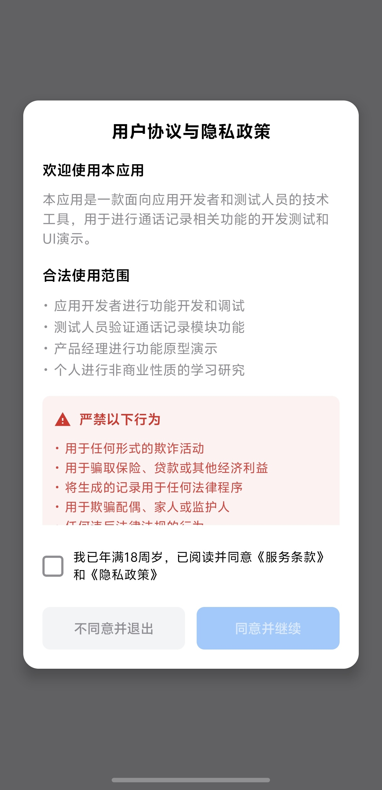

---

## 📞 生成功能

### 单条生成 - 电话号码输入

输入电话号码并配置通话参数。

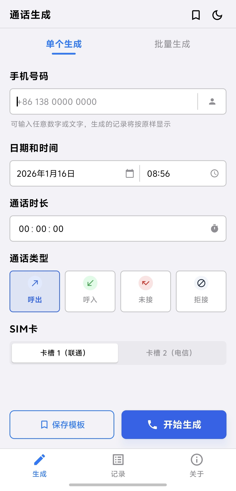

---

### 批量生成 - 归属地随机

通过选择省份城市，随机生成真实格式的手机号码。

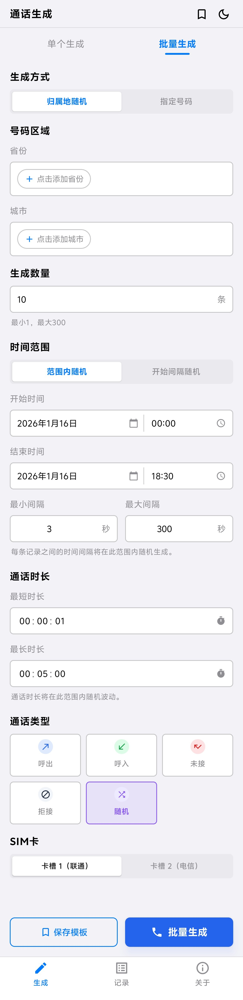

---

### 批量生成 - 指定号码

直接输入多个电话号码进行批量生成。

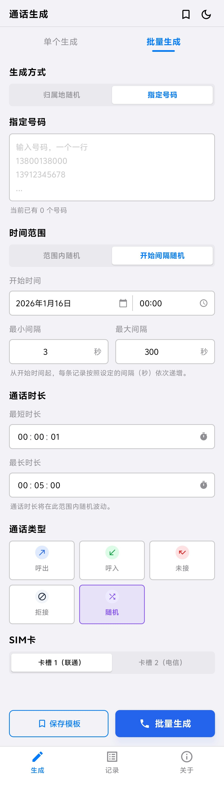

---

### 批量生成 - 冲突检测

当时间范围不足以容纳所有记录时，系统会提示冲突。

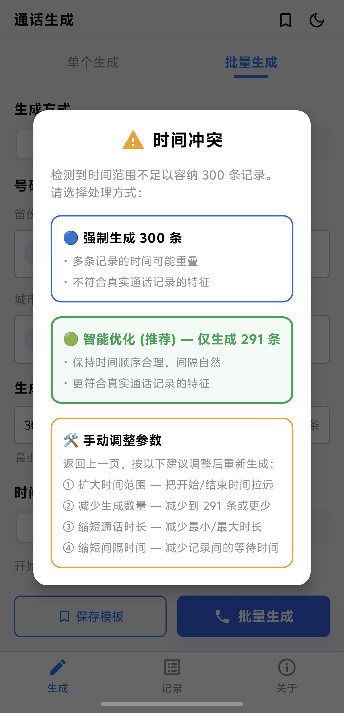

---

### 批量预览

生成前预览所有即将创建的通话记录。

---

## 📋 历史记录

### 记录列表

查看所有通过本应用生成的通话记录历史。

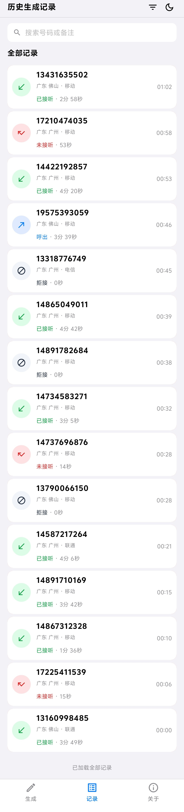

---

### 筛选与删除

支持筛选记录，左滑可删除单条记录。

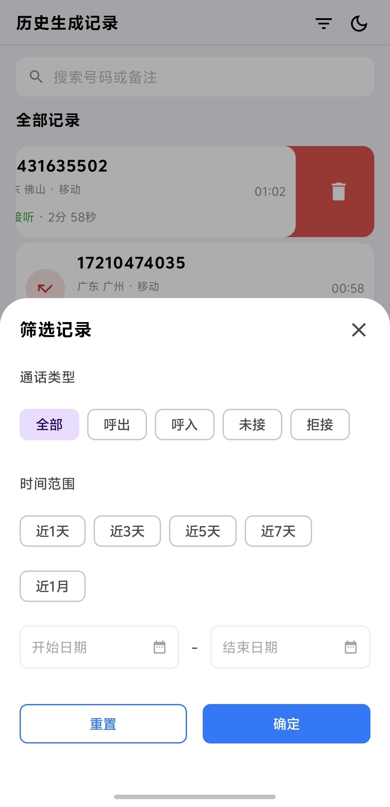

---

## 📑 模板管理

### 模板列表

查看已保存的所有模板。

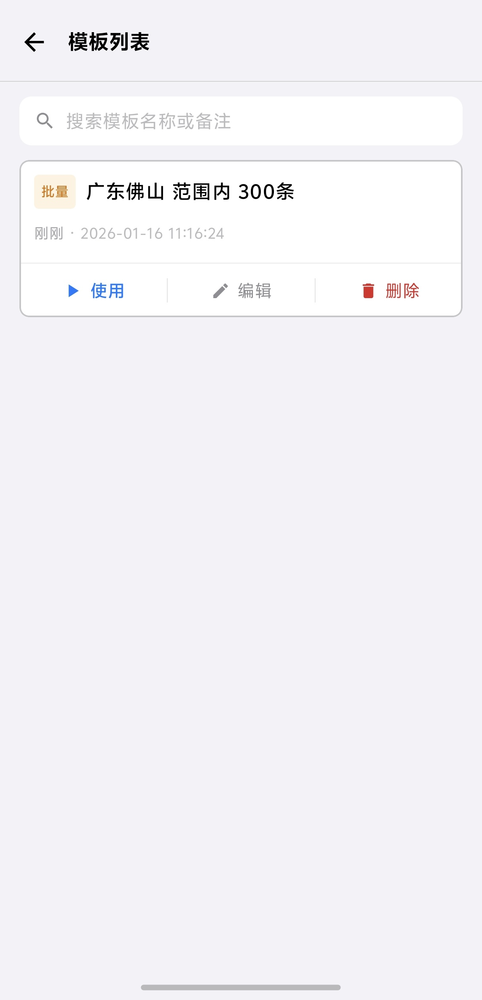

---

### 模板详情

查看模板的详细配置信息。

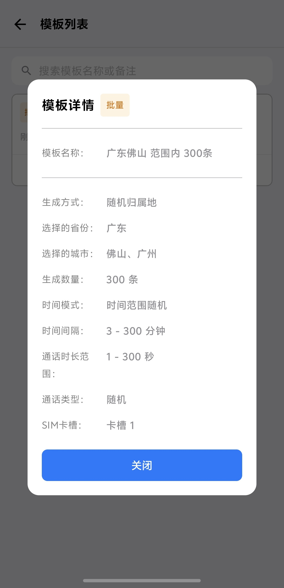

---

## ⚙️ 关于与设置

### 关于页面

应用信息、帮助文档、授权管理等入口。

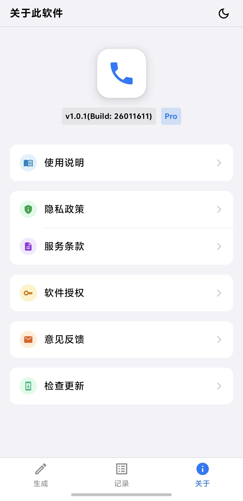

---

### 主题样式 - 深色模式

应用支持深色/暗黑模式，保护您的眼睛。

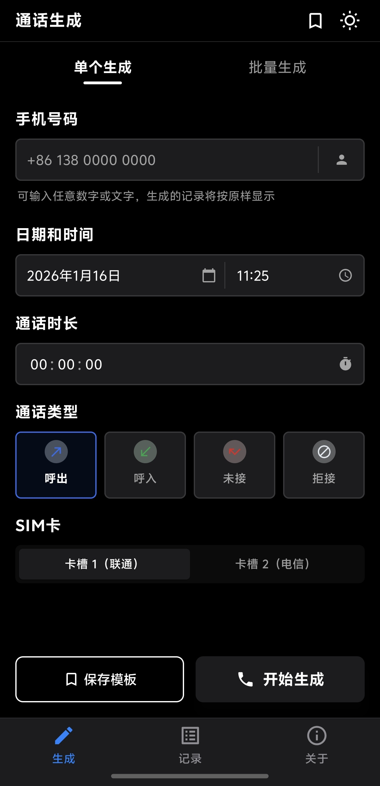

---

## 🔄 更新升级

### 检测升级提示

发现新版本时的更新提示。

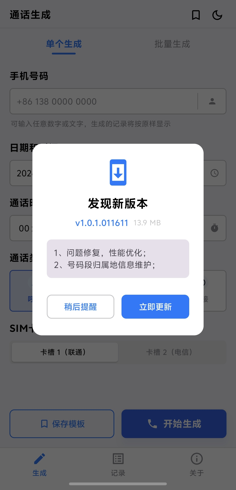

---

### 立即更新

点击更新后的下载界面。

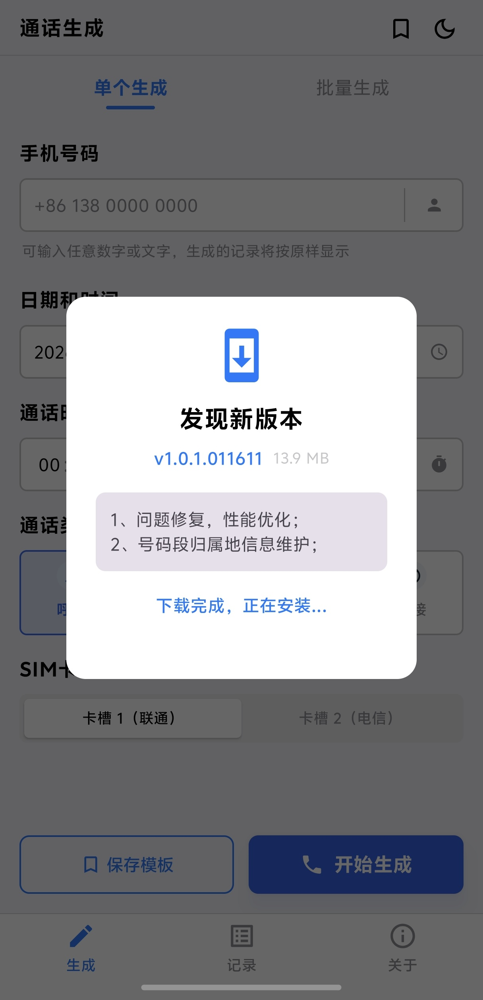

---

## 📊 截图统计

| 分类 | 数量 |
|------|------|
| 首次启动 | 1 |
| 生成功能 | 5 |
| 历史记录 | 2 |
| 模板管理 | 2 |
| 关于与设置 | 2 |
| 更新升级 | 2 |
| **总计** | **14** |

---

[← 返回使用手册](../README.md)
